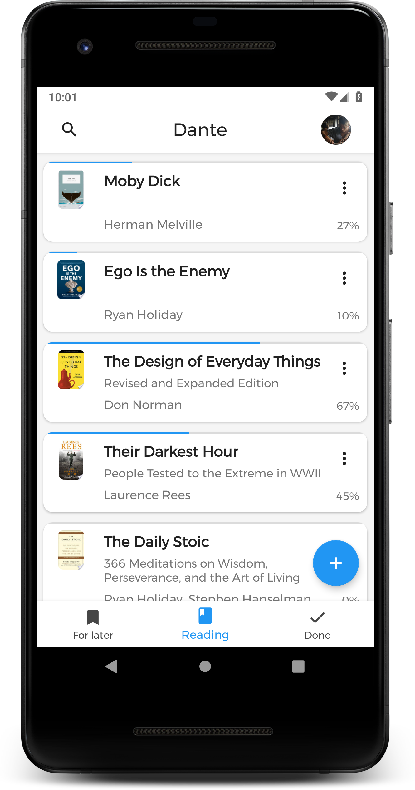
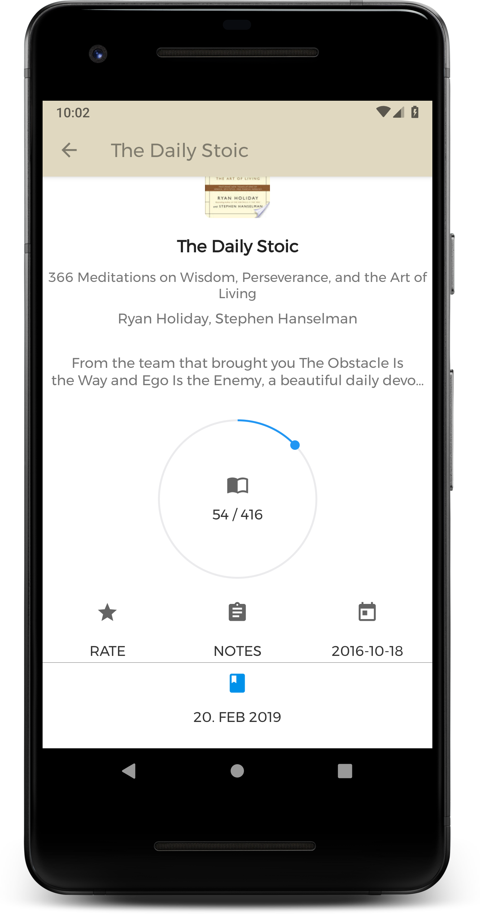
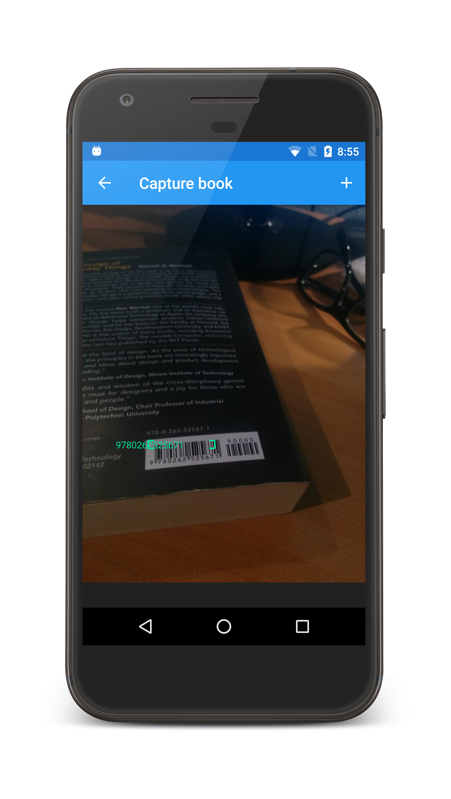

# Dante - Book Tracker

Dante lets you manage all your books by simply scanning the ISBN barcode of the book. 
It will automatically grab all information from Googles book database. 
The app let's you arrange your books into 3 different categories, whether you 
have read the book, are currently reading the book or saved the book for later. So you 
can simply keep track of your progress of all your books and their current states.

| Home screen                             | Detail screen |  Book scanning screen                                             |
|:----------------------------------------|:--------------|:----------------------------------------------|
|  |   |  |
## Setup
Checkout/Fork the repository and get the missing files which are mentioned below.
Make a pull request to the actual repository.

### Sensitive developer data
There are three files which must be explicitly added by each developer
after they checkout the project.

#### google-services.json
Get the `google-services.json` from the Firebase console.

#### /src/main/res/values/font_certs.xml
Those certs are important in order to load the custom fonts (Montserrat)
from the internet.

#### /src/main/res/values/oauth_client_id.xml
Download the client secret file from the Google Cloud Console. 
This file is necessary in order to retrieve the JWT request token of 
the user during the login process.

## Backlog
- [ ] E-Book Support

## Outlook & planned features

### Versions 5.x
- [ ] Improved search database (Google Books API) lookup query
- [ ] Shockbytes Firestore Backup
- [ ] Simplify book management
    - [ ] Remove local backup
    - [ ] Add online Shockbytes backup (based on Firebase) as only way to backup data
    - [ ] Move Goodreads CSV import from BETA to RELEASE state
    - [ ] Switch between online and offline storage (user has full control over the data)
- [ ] Add web client support
- [ ] Paged request when user clicks on "not my book" in book download view

### Version 4.2 - FIREFLASH
- [ ] Add online sync capability
  - [ ] Use Feature Flag to remotely control this feature if things go south (or better, AB test it)
  - [ ] Migrate from local to remote storage
  - [ ] Online storage switch
  - [ ] How to handle local data when switching accounts? https://github.com/realm/realm-java/issues/2153#issuecomment-174613885

### Version 4.1 - HIGH MAINTENANCE
- [ ] Like book suggestions
    - [ ] Bugfixes
    - [ ] Split wishlist and suggestions
- [x] Upgrade to Kotlin > 1.4.20
    - [x] ViewBinding
    - [x] Remove Kotterknife usage
- [ ] Backup file improvements
    - [ ] Check Backup pages & labels restore
    - [ ] Show path to local backup files
    - [ ] Open file with FileProvider
- [ ] Improve main screen
    - [ ] Bigger book covers
    - [ ] Show stars for read books
    - [x] Replace buggy SharedElementTransition for DetailPageNavigation
    - [x] Use lighter UI for labels (outline instead of filled)
    - [x] New labels screen

## Current development

### Version 4.0 - CAMPING WITH FIREBASE
* Add required Firebase Login (Google, Email, Anonymous)
    * Updated Login Flow
    * Anonymous
    * Mail
    * Google
* Upgrade to newest ktlint version
* Abstract BookId in BookEntity in order to easily switch from long to string keys
* Reworked UI
* Yearly books statistics
* Bugfixes

## Changelog

### Version 3.18.2 - Bugfixes
* Issues with outdated book data (after closing and reopening a book)
* Fix delete labels
* Fix delete page records
* FirebasModule.provideRemoteConfig crash
* BarcodeCaptureActivity.startCamera

### Version 3.18.1
* Theme Support
* Empty suggestion text bug
* Suggestions Announcement

### Version 3.18 - REMOTE SUGGESTIONS
* Smooth loading animator when uploading local images + scale down
* Non-critical Bugfixes
* Connect to Firebase suggestions API
    * Allow books suggestions from the overflow menu
    * Load suggestions from Firebase API
    * Report books
    * Cache books locally to minimize Firebase function calls
    * Explain caching
    * Let users log in from error dialog
* Allow clicks on wishlist books

### Version 3.17 - INNOVATIVE INSPIRATIONS
* Inspirations Feature
    * Wishlist for books that are not purchased yetst
    * Suggestions
* Fix bug with local book covers
    * In MultiBareBoneBookView (not showing up)
    * In the label overview (too big)

### Version 3.16 - BRING BACK BACKUP
* Google Drive REST Backup
  * Add DriveRestClient
  * Remove DriveApiClient + dependencies
  * Move dependencies in `BookStorageModule`
  * Polish Overwrite/Merge UI
  * Replace Google Drive icon
* Foundation for exporting local backups via Mail/other services
  * Open local backups via intent chooser
  * Allow external backup import in Import tab
  * Change export/import icon
  * Track open backup event (with provider)
* Replace ActionBar in BookManagement screen
* Backup issues
  * Fix Backup Proguard rules
  * Make last backup time reactive
  * Fix issues with CSV files on emulators

### Version 3.15
* Statistics pages/books over time / month + Goal per month
    * Fix issue where MarkerView draws out of ChartView bounds
    * Change toolbar behavior in Statistics screen
    * Make books per month zoomable
    * Fix problems when setting books per month reading goal offset
    * Fix issues with pages per month reading goal update
* Reset page statistics per book
* Hide page statistics in details page

### Version 3.14 - SUMMER CLEANUP
* Move sort into settings
* Improve Main UI
* Add pick random for reading button
* Pages statistics

### Version 3.13 - SMALL STEPS
* Update Crashlytics SDK
* Redesign overflow menu
* Timeline improvements (click on book, sort by start/end date)

### Version 3.12 - GO FLAT
* Go Flat: Flatten the whole layout
* Update to a stable CameraX version 1.0.0-beta03
* Desaturate label colors when in night mode

### Version 3.11 - IMPORT & EXPORT
* Allow Dante CSV import
* Dante CSV export
* Goodreads CSV import
* Deprecate Google Drive Backup
* Support remote book repository capability
* Rework Backup screen into Book management screen (Local and Online tab)

### Version 3.10 - SETTINGS AND TRACKING
* Dark Mode options DARK, LIGHT, SYSTEM_DEFAULT
* Change launcher icon
* Bring back tracking capabilities
* Smaller UI fixes
* Manual Add book cover bug

### Version 3.9 - LABELS
* Labels for books

### Version 3.8 - TIMELINE
* Timeline feature
* Various bugfixes

### Version 3.7 - SCARY SCANNING
* Redesign scan screen
* Improved dark mode

### Version 3.6 - GET EXCITED
* Move to Android App Bundles
* Improve Backups
* Open source Dante

### Version 3.5 - ADD ANDROID FRAMEWORK AWESOMENESS
* App shortcuts
* App Widget
* Use this for FAB <https://github.com/sjwall/MaterialTapTargetPrompt>

### Version 3.4 - SUBTLE SEXY FEATURES
* Investigate shared element transition missing end anchor and check for layout bugs
* Refactor to AndroidX
* Add UI for Feature flags
* Add +/- buttons for page overlay
* Android 5 as minSdk

### Version 3.3 - DETAILS & DEBTS
* Rework notes screen (give it more space)
* Allow users to add a summary in the manual add
* New details page design
* Disable summary in settings
* Change icon color of settings depending on if night mode or not
* Fix BaseAdapter bug
* Enable language selection for manual add
* Replace ImagePicker library with <https://github.com/qingmei2/RxImagePicker>
* Streamline Realm and move the query off the main thread (Provider pattern)
* Remove In-app purchases logic (or encapsulate it properly)
* Adaption of the main card

### Version 3.2 - SMALL, STEADY IMPROVEMENTS
* Include book description in Download
* Improve dark mode
* Improve search view (refactor with ViewModel)
* Improve preferences UI
* Fix layout bugs of MainActivity
* Abstract usage of ImagePicker
* Fix images for overflow menu

### Version 3.1 - DARK STATISTICS FIXES
* Dark mode
* Statistics fixes and Redesign
* Sort by pages
* Flatten UI
* Add books manually
* Abstract Glide usage with interface and object class
* Use Timber with Crashlytics Tree and increase logging
* Supporter's badge
* Integrate feature flagging and config platform

### Version 3.0 - FRESH FUN
* Fix 'wrong dates' bug
* Change dates after insertion
* Refactor detail view
* Sort book list
* General Architecture redesign (abstract Realm to exchange it)
* Fix backup mechanism
* Fresh and new UI
* Add current books to statistics (read pages to read, other pages to waiting)
* Change Analytics backend (Keen -> Google/Firebase)

### Version 2.8 - PAGES, POSITION, PROGUARD
* Include Proguard
* Show book page state as Overlay on cover in BookAdapter
* Switch position of books in category with drag and drop

### Version 2.7 - SEARCHY STATS
* Change publish date for book
* Improve statistics screen
* Search feature

### Version 2.6 - DETAILED DESIGN
* Rate books
* 100% Kotlin Port if possible
* Enter book page count manually
* Adding notes to books

### Version 2.5 - REFACTOR RAMPAGE

* Introduce utility classes (BaseFragment, BaseActivity, BackNavigableActivity)
* Introduce KotterKnife
* Update to newest ButterKnife version
* Improve backup api
* Introduce GoogleSignIn
* Add Crashlytics
* Code cleanup and Kotlin Port
* Introduction / Showcase View
* DownloadBook / QueryCapture Activity merging
* ViewPagerAdapter
* Adaptive Icons
